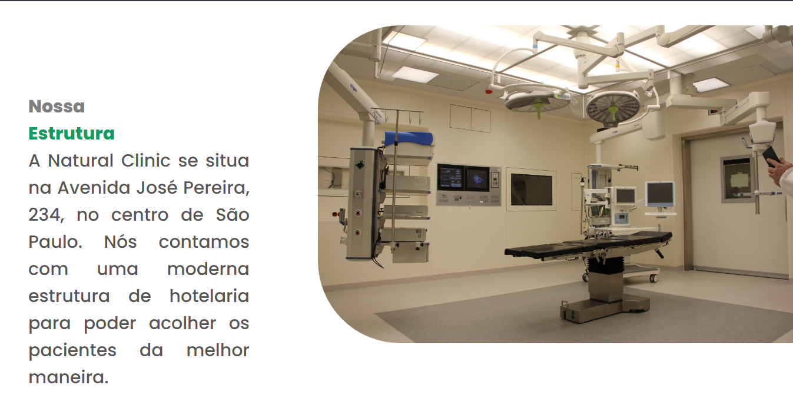
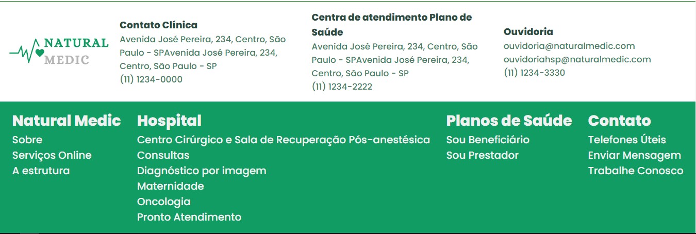

<h1 align="center">Natural Medic</h1>

A maior empresa especialista em planos de saúde na área da saúde, sempre buscando o melhor plano para você!

<h3 align="center">Home page Natural Medic</h3>

## :star2:Tecnologias utilizadas
Esse projeto foi desenvolvido com as seguintes tecnologias
- Javascript
- HTML
- CSS
- GIT e Github

## :star:APIs utilizadas
- <a href = "https://randomuser.me/"> Random User </a>
-  <a href = "https://dummyjson.com/"> Dummy JSON </a>

## :computer:Estrutura do projeto

A Natural Medic atualmente possui ao todo 7 páginas funcionais.

- Home page: Página onde se encontra as principais características,serviços e funcionalidades da Natural Medic. 
- Sobre page: Página onde é descrita mais a fundo sobre a infraestrutura e a quantidade de funcionários da empresa.
- Contato page: Área do projeto onde se encontra informações sobre o contato com a empresa, tanto por números de telefone, endereço real de uma das clínica e quanto acesso aos formulários sobre os tópicos que deseja abordar com a empresa, além de possuir um telefone para procurar por oportunidades de emprego.
- Form pages: Páginas onde se encontram os formlários para preencher para entrar em contato com a empresa. 
- Desubra clínica/ avaliação page: Página onde é possível procurar uma clínica o mais perto possível de sua residência por meio da inserção do CEP, além de mostrar os médicos disponíveis. Além dessa funcionalidade, é possível avaliar nossos atendimentos por meio do preenchimento do formulário na página.
- Login page: Página para o usuário usar suas credencias para ter acesso ao seu próprio dashboard.
- Dashboard page: Área onde se encontra informações sobre o usuário como o histórico de consultas e de exames realizados, além do gráfico geral de avaliação sobre o estado em que se encontra a saúde do usuário.

## :triangular_flag_on_post:Licença

Este projeto está utilizando a MIT License.

## :pencil2:Autores
Desenvolvido por: Vinicius, Guilherme, Luis De Paula e Pablo.

## Deploy
Aqui se encontra o deploy do projeto:
https://natural-medic-gustghost.vercel.app/
